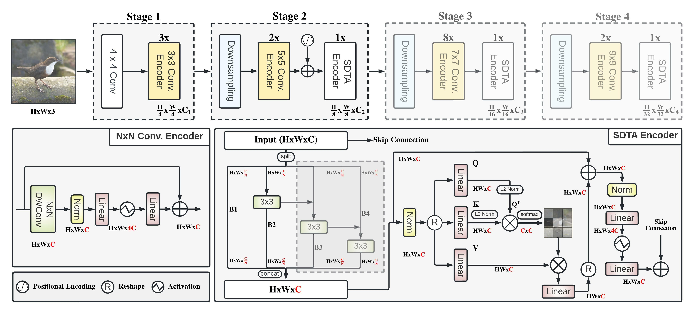

# EdgeNeXt: 
Light-weight and Efficient Networks for Mobile Vision Applications

## :rocket: News
* Training and evaluation code along with pre-trained models will be released soon. Stay tuned!

> **Abstract:** *Designing lightweight general purpose networks for edge devices is a challenging task due to the compute constraints. In this domain, CNN-based light-weight architectures are considered the de-facto choice due to their efficiency in terms of parameters and complexity. However, they are based on spatially local operations and exhibit a limited receptive field. While vision transformers alleviate these issues and can learn global representations, they are typically compute intensive and difficult to optimize. Here, we investigate how to effectively encode both local and global information, while being efficient in terms of both parameters and MAdds on vision tasks. To this end, we propose EdgeNeXt, a hybrid CNN-Transformer architecture that strives to jointly optimize parameters and MAdds for efficient inference on edge devices. Within our EdgeNeXt, we introduce split depthwise transpose attention (SDTA) encoder that splits input tensors into multiple channel groups and utilizes depthwise convolution along with self-attention across channel dimensions to implicitly increase the receptive field and encode multi-scale features. Our extensive experiments on classification, detection and segmentation settings, reveal the merits of the proposed approach, outperforming state-of-the-art methods with comparatively lower compute requirements. Our EdgeNeXt model with 1.3M parameters achieves 71.2\% top-1 accuracy on ImageNet-1K, outperforming MobileViT with an absolute gain of 2.2\% with similar parameters and 28\% reduction in MAdds. Further, our EdgeNeXt model with 5.6M parameters achieves 79.4\% top-1 accuracy on ImageNet-1K.* 

## Comparison with SOTA ViTs and Hybrid Designs
