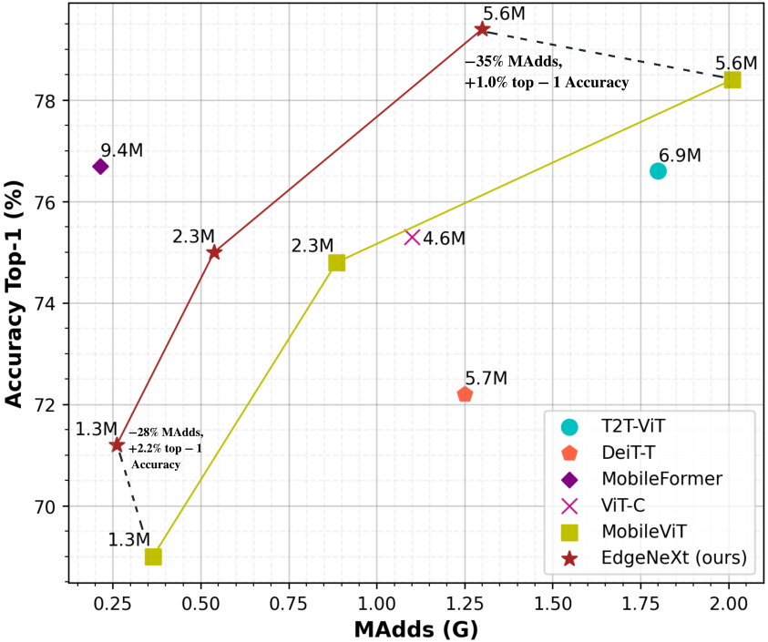

# EdgeNeXt
Light-weight and Efficient Networks for Mobile Vision Applications

## :rocket: News
* Training and evaluation code along with pre-trained models is released.

<hr />


> **Abstract:** *Designing lightweight general purpose networks for edge devices is a challenging task due to the compute constraints. In this domain, CNN-based light-weight architectures are considered the de-facto choice due to their efficiency in terms of parameters and complexity. However, they are based on spatially local operations and exhibit a limited receptive field. While vision transformers alleviate these issues and can learn global representations, they are typically compute intensive and difficult to optimize. Here, we investigate how to effectively encode both local and global information, while being efficient in terms of both parameters and MAdds on vision tasks. To this end, we propose EdgeNeXt, a hybrid CNN-Transformer architecture that strives to jointly optimize parameters and MAdds for efficient inference on edge devices. Within our EdgeNeXt, we introduce split depthwise transpose attention (SDTA) encoder that splits input tensors into multiple channel groups and utilizes depthwise convolution along with self-attention across channel dimensions to implicitly increase the receptive field and encode multi-scale features. Our extensive experiments on classification, detection and segmentation settings, reveal the merits of the proposed approach, outperforming state-of-the-art methods with comparatively lower compute requirements. Our EdgeNeXt model with 1.3M parameters achieves 71.2\% top-1 accuracy on ImageNet-1K, outperforming MobileViT with an absolute gain of 2.2\% with similar parameters and 28\% reduction in MAdds. Further, our EdgeNeXt model with 5.6M parameters achieves 79.4\% top-1 accuracy on ImageNet-1K.* 
<hr />

## Comparison with SOTA ViTs and Hybrid Architectures


<hr />

## Comparison with Previous SOTA [MobileViT (ICLR-2022)](https://arxiv.org/abs/2110.02178)


<hr />

## Installation
1. Create conda environment
```shell
conda create --name edgenext python=3.8
conda activate edgenext
```
2. Install PyTorch and torchvision
```shell
pip install torch torchvision --extra-index-url https://download.pytorch.org/whl/cu113
```
3. Install other dependencies
```shell
pip install -r requirements.txt
```

<hr />

## Dataset Preparation
Download the [ImageNet-1K](http://image-net.org/) classification dataset and structure the data as follows:
```
/path/to/imagenet-1k/
  train/
    class1/
      img1.jpeg
    class2/
      img2.jpeg
  val/
    class1/
      img3.jpeg
    class2/
      img4.jpeg
```

<hr />

## Evaluation
Download the pretrained weights and run the following command for evaluation on ImageNet-1K dataset.

```shell
wget https://github.com/mmaaz60/EdgeNeXt/releases/download/v1.0/edgenext_small.pth
python main.py --model edgenext_small --eval True --batch_size 16 --data_path <path to imagenet> --output_dir <results> --resume edgenext_small.pth
```
This should give,
```text
Acc@1 79.412 Acc@5 94.512 loss 0.881
```

## Training

On a single machine with 8 GPUs, run the following command to train EdgeNeXt-S model.

```shell
python -m torch.distributed.launch --nproc_per_node=8 main.py \
--model edgenext_small --drop_path 0.1 \
--batch_size 256 --lr 6e-3 --update_freq 2 \
--model_ema true --model_ema_eval true \
--data_path </path/to/imagenet-1k> \
--output_dir </path/to/save_results> \
--use_amp True --multi_scale_sampler
```

## Model Zoo

| Name |Acc@1 | #Params | MAdds | Model |
|:---:|:---:|:---:| :---:|:---:|
| edgenext_small | 79.43 | 5.59M | 1.26G | [model](https://github.com/mmaaz60/EdgeNeXt/releases/download/v1.0/edgenext_small.pth)
| edgenext_x_small | 75.00 | 2.34M | 538M | [model](https://github.com/mmaaz60/EdgeNeXt/releases/download/v1.0/edgenext_x_small.pth)
| edgenext_xx_small | 71.23 | 1.33M | 261M | [model](https://github.com/mmaaz60/EdgeNeXt/releases/download/v1.0/edgenext_xx_small.pth)
| edgenext_small_bn_hs | 78.39 | 5.58M | 1.25G | [model](https://github.com/mmaaz60/EdgeNeXt/releases/download/v1.0/edgenext_small_bn_hs.pth)
| edgenext_x_small_bn_hs | 74.87 | 2.34M | 536M | [model](https://github.com/mmaaz60/EdgeNeXt/releases/download/v1.0/edgenext_x_small_bn_hs.pth)
| edgenext_xx_small_bn_hs | 70.33 | 1.33M | 260M | [model](https://github.com/mmaaz60/EdgeNeXt/releases/download/v1.0/edgenext_xx_small_bn_hs.pth)