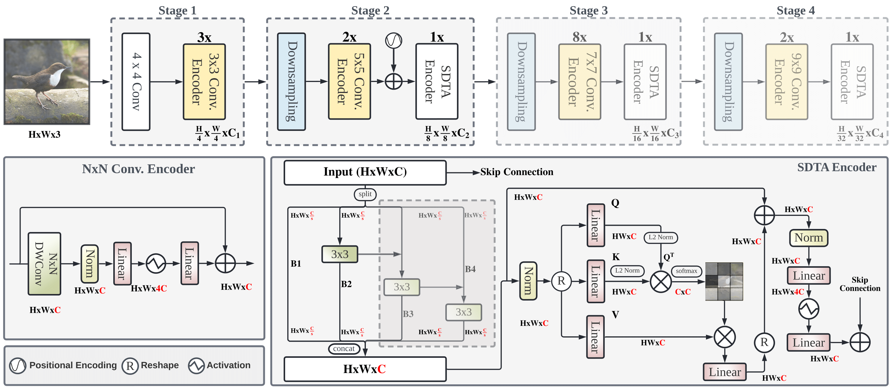

# EdgeNeXt
### **EdgeNeXt: Efficiently Amalgamated CNN-Transformer Architecture for Mobile Vision Applications [CADL'22, ECCVW]**

[Muhammad Maaz](https://scholar.google.com/citations?user=vTy9Te8AAAAJ&hl=en&authuser=1&oi=sra), 
[Abdelrahman Shaker](https://scholar.google.com/citations?hl=en&user=eEz4Wu4AAAAJ),
[Hisham Cholakkal](https://scholar.google.com/citations?hl=en&user=bZ3YBRcAAAAJ),
[Salman Khan](https://salman-h-khan.github.io),
[Syed Waqas Zamir](https://www.waqaszamir.com),
[Rao Muhammad Anwer](https://scholar.google.com/citations?hl=en&authuser=1&user=_KlvMVoAAAAJ)
and [Fahad Shahbaz Khan](https://scholar.google.es/citations?user=zvaeYnUAAAAJ&hl=en)

[](https://mmaaz60.github.io/EdgeNeXt)
[](https://arxiv.org/abs/2206.10589)
[](https://www.youtube.com/watch?v=Oh-ooHlx58o)
[](https://mbzuaiac-my.sharepoint.com/:b:/g/personal/muhammad_maaz_mbzuai_ac_ae/EaFA4bSPEMBNlJuHMbKDD3UBHmwXrmpijSRqZITk2l1-wQ?e=b7ruLV)

## :rocket: News
* **(Jul 26, 2023):** [SwiftFormer](https://github.com/Amshaker/SwiftFormer) is accepted at ICCV 2023 :fire::fire::fire:.
* **(Mar 28, 2023):** [SwiftFormer](https://github.com/Amshaker/SwiftFormer) is released :fire::fire::fire:. Our small variant achieves 78.5% top-1 ImageNet-1K accuracy with only 0.8 ms latency on iPhone 14.
* **(Aug 10, 2022):** EdgeNeXt-B ImageNet-21K pretrained model is released. It achieves 83.31% top-1 ImageNet-1K accuracy. The weights are available at [EdgeNeXt-B-IN21K](https://github.com/mmaaz60/EdgeNeXt/releases/download/v1.21/edgenext_base_IN21K.pth).
* **(Oct 23, 2022):** EdgeNeXt is presented at [International Workshop on Computational Aspects of Deep Learning at ECCV 2022](https://ailb-web.ing.unimore.it/cadl2022) in a *full length oral presentation*.
* **(Jul 28, 2022):** EdgeNeXt-B model is released. It achieves 82.5% top-1 ImageNet-1K accuracy with 18.51M parameters and 3.84G MAdds.
Further, using USI (https://arxiv.org/abs/2204.03475) training recipe, the same model achieves 83.7% accuracy.

* **(Jun 28, 2022):** EdgeNeXt-S model trained using USI (https://arxiv.org/abs/2204.03475) is released. 
  It achieves 81.1% top-1 ImageNet-1K accuracy with only 5.59M parameters and 1.26G MAdds.

* **(Jun 22, 2022):** Training and evaluation code along with pre-trained models are released.
  
<hr />


> **Abstract:** *In the pursuit of achieving ever-increasing accuracy, large and complex neural networks are usually developed. Such models demand high computational resources and therefore cannot be deployed on edge devices. It is of great interest to build resource-efficient general purpose networks due to their usefulness in several application areas. In this work, we strive to effectively combine the strengths of both CNN and Transformer models and propose a new efficient hybrid architecture EdgeNeXt. Specifically in EdgeNeXt, we introduce split depth-wise transpose attention (SDTA) encoder that splits input tensors into multiple channel groups and utilizes depth-wise convolution along with self-attention across channel dimensions to implicitly increase the receptive field and encode multi-scale features. Our extensive experiments on classification, detection and segmentation tasks, reveal the merits of the proposed approach, outperforming state-of-the-art methods with comparatively lower compute requirements. Our EdgeNeXt model with 1.3M parameters achieves 71.2\% top-1 accuracy on ImageNet-1K, outperforming MobileViT with an absolute gain of 2.2\% with 28\% reduction in FLOPs. Further, our EdgeNeXt model with 5.6M parameters achieves 79.4\% top-1 accuracy on ImageNet-1K.* 
<hr />

## Model Zoo

| Name |Acc@1 | #Params | MAdds | Model |
|---|:---:|:---:| :---:|:---:|
| edgenext_base_usi | 83.68 | 18.51M | 3.84G  | [model](https://github.com/mmaaz60/EdgeNeXt/releases/download/v1.2/edgenext_base_usi.pth)
| edgenext_base_IN21K | 83.31 | 18.51M | 3.84G | [model](https://github.com/mmaaz60/EdgeNeXt/releases/download/v1.21/edgenext_base_IN21K.pth)
| edgenext_base | 82.47 | 18.51M | 3.84G | [model](https://github.com/mmaaz60/EdgeNeXt/releases/download/v1.2/edgenext_base.pth)
| edgenext_small_usi | 81.07 | 5.59M | 1.26G | [model](https://github.com/mmaaz60/EdgeNeXt/releases/download/v1.1/edgenext_small_usi.pth)
| edgenext_small | 79.41 | 5.59M | 1.26G | [model](https://github.com/mmaaz60/EdgeNeXt/releases/download/v1.0/edgenext_small.pth)
| edgenext_x_small | 74.96 | 2.34M | 538M | [model](https://github.com/mmaaz60/EdgeNeXt/releases/download/v1.0/edgenext_x_small.pth)
| edgenext_xx_small | 71.23 | 1.33M | 261M | [model](https://github.com/mmaaz60/EdgeNeXt/releases/download/v1.0/edgenext_xx_small.pth)
| edgenext_small_bn_hs | 78.39 | 5.58M | 1.25G | [model](https://github.com/mmaaz60/EdgeNeXt/releases/download/v1.0/edgenext_small_bn_hs.pth)
| edgenext_x_small_bn_hs | 74.87 | 2.34M | 536M | [model](https://github.com/mmaaz60/EdgeNeXt/releases/download/v1.0/edgenext_x_small_bn_hs.pth)
| edgenext_xx_small_bn_hs | 70.33 | 1.33M | 260M | [model](https://github.com/mmaaz60/EdgeNeXt/releases/download/v1.0/edgenext_xx_small_bn_hs.pth)

<hr />

## Comparison with SOTA ViTs and Hybrid Architectures


<hr />

## Comparison with Previous SOTA [MobileViT (ICLR-2022)](https://arxiv.org/abs/2110.02178)


<hr />

## Qualitative Results (Segmentation)


## Installation
1. Create conda environment
```shell
conda create --name edgenext python=3.8
conda activate edgenext
```
2. Install PyTorch and torchvision
```shell
pip install torch torchvision --extra-index-url https://download.pytorch.org/whl/cu113
```
3. Install other dependencies
```shell
pip install -r requirements.txt
```

<hr />

## Dataset Preparation
Download the [ImageNet-1K](http://image-net.org/) classification dataset and structure the data as follows:
```
/path/to/imagenet-1k/
  train/
    class1/
      img1.jpeg
    class2/
      img2.jpeg
  val/
    class1/
      img3.jpeg
    class2/
      img4.jpeg
```

<hr />

## Evaluation
Download the pretrained weights and run the following command for evaluation on ImageNet-1K dataset.

```shell
wget https://github.com/mmaaz60/EdgeNeXt/releases/download/v1.0/edgenext_small.pth
python main.py --model edgenext_small --eval True --batch_size 16 --data_path <path to imagenet> --output_dir <results> --resume edgenext_small.pth
```
This should give,
```text
Acc@1 79.412 Acc@5 94.512 loss 0.881
```

##### Note: For evaluating the USI model, please set `usi_eval True`.

<hr />

## Training

On a single machine with 8 GPUs, run the following command to train EdgeNeXt-S model.

```shell
python -m torch.distributed.launch --nproc_per_node=8 main.py \
--model edgenext_small --drop_path 0.1 \
--batch_size 256 --lr 6e-3 --update_freq 2 \
--model_ema true --model_ema_eval true \
--data_path </path/to/imagenet-1k> \
--output_dir </path/to/save_results> \
--use_amp True --multi_scale_sampler
```
<hr />

## Citation
If you use our work, please consider citing:
```bibtex
    @inproceedings{Maaz2022EdgeNeXt,
      title={EdgeNeXt: Efficiently Amalgamated CNN-Transformer Architecture for Mobile Vision Applications},
        author={Muhammad Maaz and Abdelrahman Shaker and Hisham Cholakkal and Salman Khan and Syed Waqas Zamir and Rao Muhammad Anwer and Fahad Shahbaz Khan},
      booktitle={International Workshop on Computational Aspects of Deep Learning at 17th European Conference on Computer Vision (CADL2022)},
      year={2022},
      organization={Springer}
}
```

<hr />

## Contact
Should you have any question, please create an issue on this repository or contact at muhammad.maaz@mbzuai.ac.ae & abdelrahman.youssief@mbzuai.ac.ae

<hr />

## References
Our code is based on [ConvNeXt](https://github.com/facebookresearch/ConvNeXt) repository. 
We thank them for releasing their code.

## Our Related Works
- SwiftFormer: Efficient Additive Attention for Transformer-based Real-time Mobile Vision Applications. [Paper](https://arxiv.org/abs/2303.15446) | [Code](https://github.com/Amshaker/SwiftFormer).
