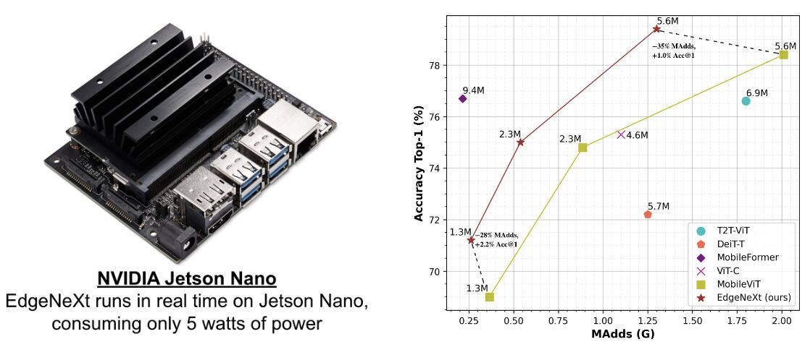
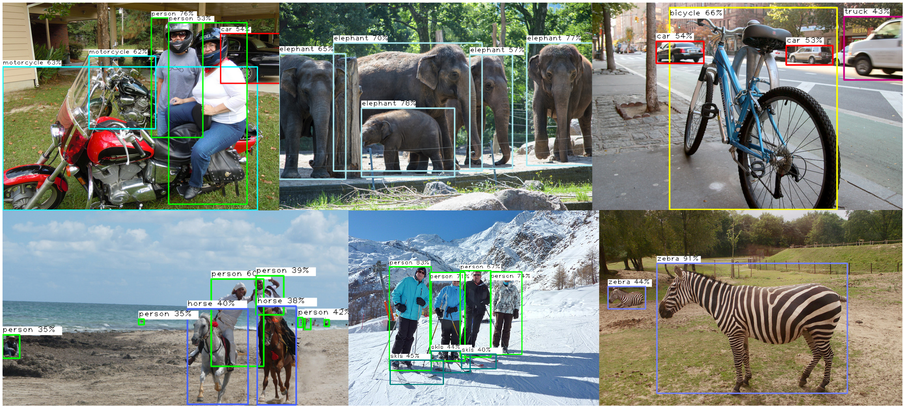

[Muhammad Maaz](https://scholar.google.com/citations?user=vTy9Te8AAAAJ&hl=en&authuser=1&oi=sra), [Abdelrahman Shaker](https://scholar.google.com/citations?hl=en&user=eEz4Wu4AAAAJ), [Hisham Cholakkal](https://scholar.google.com/citations?hl=en&user=bZ3YBRcAAAAJ), [Salman Khan](https://salman-h-khan.github.io/), [Syed Waqas Zamir](https://www.waqaszamir.com/), [Rao Muhammad Anwer](https://scholar.google.com/citations?hl=en&authuser=1&user=_KlvMVoAAAAJ), and [Fahad Khan](https://scholar.google.es/citations?user=zvaeYnUAAAAJ&hl=en)


<br>

&emsp;&emsp;&emsp;&emsp;&emsp;&emsp;&emsp;&emsp;&emsp;&emsp;&emsp;&emsp;&emsp;&emsp;&emsp;&emsp;  [Paper](https://arxiv.org/abs/2206.10589): [](https://arxiv.org/abs/2206.10589)  , [Code:](https://github.com/mmaaz60/EdgeNeXt) [](https://github.com/mmaaz60/EdgeNeXt), [Slides:](https://mbzuaiac-my.sharepoint.com/personal/muhammad_maaz_mbzuai_ac_ae/_layouts/15/onedrive.aspx?id=%2Fpersonal%2Fmuhammad%5Fmaaz%5Fmbzuai%5Fac%5Fae%2FDocuments%2FMS%5FThesis%2FEdgeNeXt%2FEdgeNeXt%2Epdf&parent=%2Fpersonal%2Fmuhammad%5Fmaaz%5Fmbzuai%5Fac%5Fae%2FDocuments%2FMS%5FThesis%2FEdgeNeXt&ga=1) [](https://mbzuaiac-my.sharepoint.com/personal/muhammad_maaz_mbzuai_ac_ae/_layouts/15/onedrive.aspx?id=%2Fpersonal%2Fmuhammad%5Fmaaz%5Fmbzuai%5Fac%5Fae%2FDocuments%2FMS%5FThesis%2FEdgeNeXt%2FEdgeNeXt%2Epdf&parent=%2Fpersonal%2Fmuhammad%5Fmaaz%5Fmbzuai%5Fac%5Fae%2FDocuments%2FMS%5FThesis%2FEdgeNeXt&ga=1)

<br>

<p align="center">
<iframe width="560" height="315" src="https://www.youtube.com/embed/Oh-ooHlx58o" title="YouTube video player" frameborder="0" allow="accelerometer; autoplay; clipboard-write; encrypted-media; gyroscope; picture-in-picture" allowfullscreen></iframe>
</p>

<br>

## Overview
<p align="center">
<!--  -->

</p>
Our proposed EdgeNeXt model runs in real time on NVIDIA Jetson Nano edge device, and achieves state-of-the-art accuracy of 79.4% on ImageNet-1K with only 5.6M parameters and 1.3G MAdds. The same model achieves 81.1% accuracy when trained using [USI](https://github.com/Alibaba-MIIL/Solving_ImageNet).

## Abstract


In the pursuit of achieving ever-increasing accuracy, large and complex neural networks are usually developed. Such models demand high computational resources and therefore cannot be deployed on edge devices. It is of great interest to build resource-efficient general purpose networks due to their usefulness in several application areas. In this work, we strive to effectively combine the strengths of both CNN and Transformer models and propose a new efficient hybrid architecture EdgeNeXt. Specifically in EdgeNeXt, we introduce split depth-wise transpose attention (SDTA) encoder that splits input tensors into multiple channel groups and utilizes depth-wise convolution along with self-attention across channel dimensions to implicitly increase the receptive field and encode multi-scale features. Our extensive experiments on classification, detection and segmentation tasks, reveal the merits of the proposed approach, outperforming state-of-the-art methods with comparatively lower compute requirements. Our EdgeNeXt model with 1.3M parameters achieves 71.2% top-1 accuracy on ImageNet-1K, outperforming MobileViT with an absolute gain of 2.2% with 28% reduction in FLOPs. Further, our EdgeNeXt model with 5.6M parameters achieves 79.4% top-1 accuracy on ImageNet-1K.

## Model Zoo

| Name |Acc@1 | #Params | MAdds | Model |
|---|:---:|:---:| :---:|:---:|
| edgenext_small_usi | 81.07 | 5.59M | 1.26G | [model](https://github.com/mmaaz60/EdgeNeXt/releases/download/v1.1/edgenext_small_usi.pth)
| edgenext_small | 79.41 | 5.59M | 1.26G | [model](https://github.com/mmaaz60/EdgeNeXt/releases/download/v1.0/edgenext_small.pth)
| edgenext_x_small | 74.96 | 2.34M | 538M | [model](https://github.com/mmaaz60/EdgeNeXt/releases/download/v1.0/edgenext_x_small.pth)
| edgenext_xx_small | 71.23 | 1.33M | 261M | [model](https://github.com/mmaaz60/EdgeNeXt/releases/download/v1.0/edgenext_xx_small.pth)
| edgenext_small_bn_hs | 78.39 | 5.58M | 1.25G | [model](https://github.com/mmaaz60/EdgeNeXt/releases/download/v1.0/edgenext_small_bn_hs.pth)
| edgenext_x_small_bn_hs | 74.87 | 2.34M | 536M | [model](https://github.com/mmaaz60/EdgeNeXt/releases/download/v1.0/edgenext_x_small_bn_hs.pth)
| edgenext_xx_small_bn_hs | 70.33 | 1.33M | 260M | [model](https://github.com/mmaaz60/EdgeNeXt/releases/download/v1.0/edgenext_xx_small_bn_hs.pth)


## Comparison with Previous SOTA [MobileViT (ICLR-2022)](https://arxiv.org/abs/2110.02178)


## Qualitative Results (Segmentation)


## Qualitative Results (Detection)



## BibTeX:
```
@misc{https://doi.org/10.48550/arxiv.2206.10589,
  doi = {10.48550/ARXIV.2206.10589},
  url = {https://arxiv.org/abs/2206.10589},
  author = {Maaz, Muhammad and Shaker, Abdelrahman and Cholakkal, Hisham and Khan, Salman and Zamir, Syed Waqas and Anwer, Rao Muhammad and Khan, Fahad Shahbaz},
  keywords = {Computer Vision and Pattern Recognition (cs.CV), FOS: Computer and information sciences, FOS: Computer and information sciences},
  title = {EdgeNeXt: Efficiently Amalgamated CNN-Transformer Architecture for Mobile Vision Applications},
  publisher = {arXiv},
  year = {2022},
  copyright = {Creative Commons Attribution 4.0 International}
}
```
